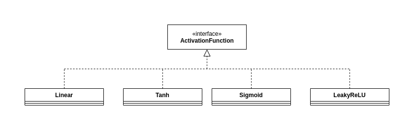
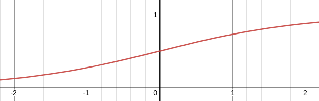
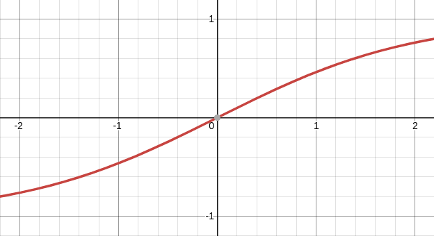
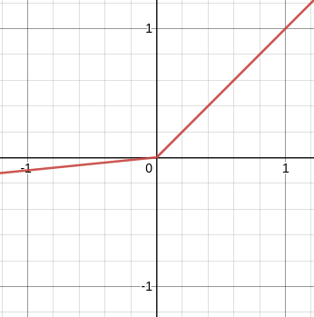
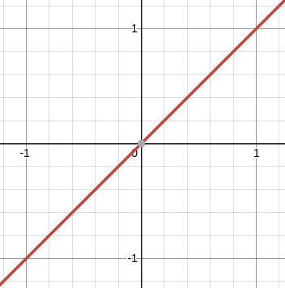

# Activation Functions

Activation functions are a simple mapping from real numbers to real numbers that are used in Dense Neural Network layers. Most of these activation functions are non-linear in nature, which allow the neural network to approximate non-linear functions.

These functions are implemented by the ActivationFunction abstract class which provides a template to implement functionality. An abstract class is used
instead of an interface because the vector/array input and output methods are already implemented. Methods that need to be implemented in derived classes,
namely the f() and fPrime() methods, are written as abstract methods.

## The ActivationFunction abstract class

The following 2 methods are abstract and must be implemented when extending the class:

### float f(float x)

The f(float x) method is simply the activation function applied to a single input variable. Most of the time, this function should be non-linear, so that the neural network can find non-linear relationships in training data. Also, in order to avoid the "exploding gradient problem",the slope of this function should not be large as x approaches negative and positive infinity.

### float fPrime(float x)

The fPrime(float x) method is simply the derivative of the f(float x) function. It's important to implement this correctly so that the backpropagation step used in fitting the neural network works correctly.

The following methods are already implemented, but can be implemented in derived classes if desired:

### void f(float[] x, float[] dest)

This method simply calls the single variable f() method on each component in the x array and places the result in the corresponding index in the dest array.

### float[] f(float[] x)

Similar to the above method, this method calls the single variable f() method on each component in the x array and returns the result

### void fPrime(float[] x, float[] dest)

This method simply calls the single variable fPrime() method on each component in the x array and places the result in the corresponding index in the dest array.

### float[] fPrime(float[] x)

Similar to the above method, this method calls the single variable fPrime() method on each component in the x array and returns the result

## Derived classes

### Sigmoid

The Sigmoid function is a popular non-linear activation function that is used in hidden layers. The primary characteristic is that the output is in the range (0,1). This characteristic also makes it difficult for the function to output a low signal, since the input must approach -infinity for the output of the sigmoid function to equal 0. However, this function is useful in binary classification tasks.

### Tanh

The tanh function is a popular non-linear activation function that is used in hidden layers. The primary characteristics are that the output is in the range (-1,1), tanh(0) = 0, and tanh'(x) = 0 as x approaches both negative and positive infinity. This non-linear activation function is popular because it can easily become "inactive" at x = 0, unlike the sigmoid activation function. Similar to the sigmoid activation function, this function suffers from the "dying gradient problem" when inputs become too large or too small, which can drastically slow learning.

### LeakyReLU

The LeakyReLU activation function is also very popular to use in hidden layers. Unlike the tanh activation function, both the output and derivative of this function is dependent on a user selected alpha parameter, which represents the slope of the function when x <= 0. Overall, the function is a linear piecewise function, which has a slope of 1 for x > 0, and a slope of alpha for x <= 0. Consequently, this means that this function could output values in the range of (-infinity, infinity) and has a derivative of either alpha or 1. This solves the "dying gradient problem mentioned in the Tanh function section, but also introduces the "exploding gradient problem", where extremely low and high outputs can produce gradients with very strong signals (although this problem can be alleviated with adaptive learning rate optimizers and gradient clipping).

### Linear

The Linear activation function is the simplest activation function included in this library. It simply returns the input value as the output. This function is typically used as a neural network's output layer activation function since it outputs values in (-infinity, infinity). This function is almost never used in hidden layers because it cannot approximate non linear functions.

(Activation function plots created with Desmos)