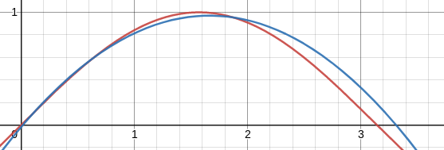

# Examples

The Examples.java class provides demonstrations of model usage, including model creation, training, prediction, and saving models to disk.
These examples also serve as black box tests to ensure that the model functionality behaves as expected.
The class also provides an easy command line interface to run these examples. To use, simply include the example name as the only argument
when running. For example:

`javac Examples.java`

`java Examples simplelinear`

Compiles the Examples class and then runs the "simplelinear" example. For a list of all argument strings, simply provide no argument when
executing the program.

In this document, a brief description of each example will be provided alongside the program output


## LinearModel


### simplelinear

The simplelinear example demonstrates the creation, training, and evaluation of a simple linear model that aims to learn the function
f(x) = 2x -1. The training input data is generated from a random uniform distribution in the range (-10, 10). In order to evaluate
how well the training process worked, the model loss from the dataset will be recorded from both before and after training. Since 
the underlying training data is from a linear function, the post training loss should be extremely small compared to the pre training
loss.

Program output:

```
Starting Simple Linear Model example: Fitting model to f(x) = 2x - 1
Creating dataset...
Creating the linear model...
Training the linear model...
Training complete. Loss before training should be greater than loss after training:
Loss before training: 263.4652
Loss after training: 0.60140973
```


### complexlinear

The complexlinear example demonstrates training a LinearModel on a randomly generated linear function which takes an input vector of length 3
and outputs a vector of length 3. The randomly generated linear function is simply a randomized transformation matrix and bias vector.
The input and output vectors from this linear function are then used as training data for a LinearModel. Since the training data is from a
linear function, the trained LinearModel should be nearly identical to the original linear function. Loss from before training should be much greater
than the loss after training. Additionally, this example demonstrates the ability to save a LinearModel to disk (in this case, as "ComplexLinearModel")
and load it back into memory. After loading the LinearModel back into memory, the loss will be evaluated again to see if the saving and loading process
worked correctly. Both the before and after save/loading loss should be the same.

Program output:

```
Starting complex LinearModel example.
Will generate data from a randomized transformation and bias matrix, then train a linear model on it.
After training, the learned parameters will then be compared to the original data generation matricies to determine if training worked.
To see if model saving/loading works, the LinearModel will be saved to disk, reloaded, and then compared outputs.
Generating data...
Creating LinearModel and training...
Model trained. End loss should be smaller than start loss:
Start loss: 42.89671
End loss: 7.126446E-11
Saving trained model to disk...
Loading model from disk...
Model loaded. Check loss. Loss from model should mostly match to loaded model:
Loss from trained model: 7.126446E-11
Loss from loaded model: 7.126446E-11


```


## PolynomialModel


### polynomialsin

The polynomialsin example demonstrates the creation, training, evaluation, saving, and loading abilities of the PolynomialModel.

The primary task of this example is to find a polynomial of degree 2 which most closely represents the sin(x) function where x is in (0, 3).
A polynomial approximation of the sin(x) function is desirable since computers can't calculate sin(x) directly and other approximation techniques
such as tables take up memory and are crude. Polynomial functions work well with computers since they only require basic mathematical operations
to compute, like addition and multiplication. A polynomial approxmiation of degree 2 would be quite fast since there are fewer additions and
multiplications to perform to get the approximated output. Of course, a higher degree represents an accuracy-speed tradeoff.

This example also saves the PolynomialModel to disk and then loads it back into memory to test saving and loading functionality. As with the
complexlinear example, the losses will be compared before and after training/loading.

Program output:


```
In this example, a polynomial model will be fit to data produced from the sin(x) function in order to find a fast approximation.
Creating the dataset...
Creating a polynomial model of degree 2
Training polynomial model...
Training complete. Loss from before training should be larger than loss after training:
Loss before training: 0.53037345
Loss after training: 0.0062198346
Learned polynomial is: f(x) = -0.3570667x^2 + 1.1878308x + -0.017842926
Now saving the model to file: polynomial_model_saved
Model saved. Now loading the model from file...
Model loaded. Loss on dataset on loaded model should match the previous model's loss:
Old model loss: 0.0062198346
Loaded model loss: 0.0062198346

```

As seen in the output, the learned polynomial is about f(x) = -0.357x^2 + 1.188x + -0.018

This polynomial can be plotted alongside sin(x):




where the red line is sin(x) and the blue line is the learned polynomial.

Of course, this approximation isn't perfect and could likely be improved with hyperparameter tuning.


### polynomialoverfit