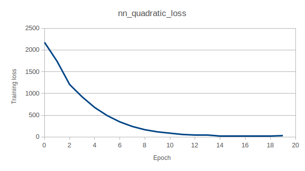

# Examples

The Examples.java class provides demonstrations of model usage, including model creation, training, prediction, and saving models to disk.
These examples also serve as black box tests to ensure that the model functionality behaves as expected.
The class also provides an easy command line interface to run these examples. To use, simply include the example name as the only argument
when running. For example:

`javac Examples.java`

`java Examples simplelinear`

Compiles the Examples class and then runs the "simplelinear" example. For a list of all argument strings, simply provide no argument when
executing the program.

In this document, a brief description of each example will be provided alongside the program output


## LinearModel


### simplelinear

The simplelinear example demonstrates the creation, training, and evaluation of a simple linear model that aims to learn the function
f(x) = 2x -1. The training input data is generated from a random uniform distribution in the range (-10, 10). In order to evaluate
how well the training process worked, the model loss from the dataset will be recorded from both before and after training. Since 
the underlying training data is from a linear function, the post training loss should be extremely small compared to the pre training
loss.

Program output:

```
Starting Simple Linear Model example: Fitting model to f(x) = 2x - 1
Creating dataset...
Creating the linear model...
Training the linear model...
Training complete. Loss before training should be greater than loss after training:
Loss before training: 263.4652
Loss after training: 0.60140973
```


### complexlinear

The complexlinear example demonstrates training a LinearModel on a randomly generated linear function which takes an input vector of length 3
and outputs a vector of length 3. The randomly generated linear function is simply a randomized transformation matrix and bias vector.
The input and output vectors from this linear function are then used as training data for a LinearModel. Since the training data is from a
linear function, the trained LinearModel should be nearly identical to the original linear function. Loss from before training should be much greater
than the loss after training. Additionally, this example demonstrates the ability to save a LinearModel to disk (in this case, as "ComplexLinearModel")
and load it back into memory. After loading the LinearModel back into memory, the loss will be evaluated again to see if the saving and loading process
worked correctly. Both the before and after save/loading loss should be the same.

Program output:

```
Starting complex LinearModel example.
Will generate data from a randomized transformation and bias matrix, then train a linear model on it.
After training, the learned parameters will then be compared to the original data generation matricies to determine if training worked.
To see if model saving/loading works, the LinearModel will be saved to disk, reloaded, and then compared outputs.
Generating data...
Creating LinearModel and training...
Model trained. End loss should be smaller than start loss:
Start loss: 42.89671
End loss: 7.126446E-11
Saving trained model to disk...
Loading model from disk...
Model loaded. Check loss. Loss from model should mostly match to loaded model:
Loss from trained model: 7.126446E-11
Loss from loaded model: 7.126446E-11


```


## PolynomialModel


### polynomialsin

The polynomialsin example demonstrates the creation, training, evaluation, saving, and loading abilities of the PolynomialModel.

The primary task of this example is to find a polynomial of degree 2 which most closely represents the sin(x) function where x is in (0, 3).
A polynomial approximation of the sin(x) function is desirable since computers can't calculate sin(x) directly and other approximation techniques
such as tables take up memory and are crude. Polynomial functions work well with computers since they only require basic mathematical operations
to compute, like addition and multiplication. A polynomial approxmiation of degree 2 would be quite fast since there are fewer additions and
multiplications to perform to get the approximated output. Of course, a higher degree represents an accuracy-speed tradeoff.

This example also saves the PolynomialModel to disk and then loads it back into memory to test saving and loading functionality. As with the
complexlinear example, the losses will be compared before and after training/loading.

Program output:


```
In this example, a polynomial model will be fit to data produced from the sin(x) function in order to find a fast approximation.
Creating the dataset...
Creating a polynomial model of degree 2
Training polynomial model...
Training complete. Loss from before training should be larger than loss after training:
Loss before training: 0.53037345
Loss after training: 0.0062198346
Learned polynomial is: f(x) = -0.3570667x^2 + 1.1878308x + -0.017842926
Now saving the model to file: polynomial_model_saved
Model saved. Now loading the model from file...
Model loaded. Loss on dataset on loaded model should match the previous model's loss:
Old model loss: 0.0062198346
Loaded model loss: 0.0062198346

```

As seen in the output, the learned polynomial is about f(x) = -0.357x^2 + 1.188x + -0.018

This polynomial can be plotted alongside sin(x):


where the red line is sin(x) and the blue line is the learned polynomial.

Of course, this approximation isn't perfect and could likely be improved with hyperparameter tuning.


### polynomialoverfit

The polynomialoverfit example demonstrates how a large parameter count can lead to overfitting, where the model "memorizes" the training data
rather than generalize it. Unlike the LinearModel, the PolynomialModel allows the user to adjust how many parameters are in the model through
the degree parameter in the constructor.

In order to demonstrate the overfitting phenomena, a small dataset of 10 samples with be created with the function f(x) = x^2, with x in (-5, 5).
Polynomial models with increasing degrees will be created and trained on this dataset. A separate test dataset, with 100 samples
from the same function, will be used to evaluate how much the model is overfitting. The general idea is that if the model is overfitting, the data
from the training dataset will be memorized rather than the original training function f(x) = x^2. In this scenario, we should expect the loss on
the testing dataset to be much higher than the training dataset loss. We can use the ratio (test/train loss) to measure overfitting.

In summary, as the degree (and parameter count) increase, the test/train loss ratio should also increase as overfitting becomes apparent.

Program output:

```
In this example, polynomial models will be fit on randomly generated data.
As higher degree polynomial models are trained, test loss should be much higher than training loss as a result of overfitting.
Test and train loss can be expressed as the ratio (test/train loss).
A test/train ratio should be close to 1 with lower degree models, and should increase as overfitting becomes apparent.

Generating data...
Data generated. Now training polynomial models.
Degree: 1, test/train loss ratio: 1.7038438
Degree: 4, test/train loss ratio: 1.0255042
Degree: 7, test/train loss ratio: 3.775513
Degree: 10, test/train loss ratio: 5.111687
Degree: 13, test/train loss ratio: 12.862402
```


## NeuralNetwork

## nnquadratic

The nnquadratic example demonstrates basic neural network construction, training, evaluation, as well as saving a model to disk and loading back into memory.
A standard 2 hidden layer neural network is created with an input vector and output vector of size 1.
A simple training dataset of f(x) = x^2 for x in (-10, 10) is created to train the neural network on. Every epoch the training loss will be evaluated and 
displayed to the user. Additionally, the model will make predictions on x in (-10, 10) every epoch and the outputs will be recorded.
At the end of training, both the training loss data and the output data will be written to disk under the names nn_quadratic_output.csv, and nn_quadratic_loss.csv.

The model saving/loading functionality will be tested, and the model will be saved to disk before being removed from memory. Then, a new model will be created from
the disk file. The training loss before and after loading the model from disk will determine if the model saving and loading process was sucessful.

Program output:

```
In this example, a neural network will be created to fit f(x) = x^2 for x in [-10, 10].
Over the course of training, the training loss will be recorded as well as the neural network output after each epoch
After training, the training loss will be recorded before the model is saved to disk, deallocated, and recreated from disk.
Creating training dataset of size 1000
Creating neural network
Training started...
Train loss before epoch 0: 2175.506
Train loss before epoch 1: 1740.6473
Train loss before epoch 2: 1205.8613
Train loss before epoch 3: 920.9347
Train loss before epoch 4: 676.57086
Train loss before epoch 5: 489.8206
Train loss before epoch 6: 346.61267
Train loss before epoch 7: 240.06915
Train loss before epoch 8: 165.00542
Train loss before epoch 9: 116.3945
Train loss before epoch 10: 85.83927
Train loss before epoch 11: 56.20883
Train loss before epoch 12: 37.92646
Train loss before epoch 13: 45.397247
Train loss before epoch 14: 21.943964
Train loss before epoch 15: 19.660944
Train loss before epoch 16: 20.7551
Train loss before epoch 17: 17.870653
Train loss before epoch 18: 18.101418
Train loss before epoch 19: 29.60965
Training complete. Writing results to disk...
Training loss function data written to disk. Check for nn_quadratic_loss.csv where Examples.java is.
Function output data written to disk. Check for nn_quadratic_output.csv where Examples.java is.
```

Using external software that can produce plots, the following graphs can be made:

nn_quadratic_loss.csv:




The loss curve here is what is expected when training a neural network with a sufficient number of parameters. Loss starts out high
and decreases slowly as the training process continues.


nn_quadratic_output.csv:


The neural network outputs at different epochs visually display the training process. Before training, at epoch 0, the outputs display a function that is not
at all a representation of f(x) = x^2. However, as training progresses, the outputs start to resemble the target function that generated the training data.


## nnoverfit

## nnbinaryclassification

The nnbinaryclassification example demonstrates the use of neural networks for binary classification tasks which separate inputs into two distinct classes.
In this example, the input data will be points on a 2d plane forming the tuple (x1, x2), where x1, x2 are in the range (0,1). Inputs that are within a circle
whose center is at (0.5, 0.5) and has a radius 0.5 are part of class 0, and all else are part of class 1. The goal of the neural network classifier is to 
find the "decision boundary" that separates these data points into the correct classes. In this example, the decision boundary is a circle:


The neural network classifier is a standard 2 hidden layer neural network. The Dense output layer uses the sigmoid activation function, which outputs numbers in the range (0, 1) which makes it ideal for binary classification tasks. This neural network is trained on generated data with a binary cross entropy loss, which uses binary values as
the ground truths.

After training, the training loss is displayed as well as an accuracy metric, which rounds predicted values to either 0 or 1.


Program output:

```
In this example a demonstration of a binary classification task will be performed.
A neural network will be constructed with an input vector of size two and an output vector of size 1 with a sigmoid activation function
The training input data will be (x1,x2) coordinates with x1, x2 in range (0,1). Each (x1,x2) pair will be considered to be a member of 2 classes.
(x1,x2) coordinates that lie inside of a circle that has a center at (0.5,0.5) and a radius of 0.5 will belong to class 0.
All other (x1,x2) coordinates will belong to class 1.

Creating the dataset...
Creating the neural network classifier...
Fitting the neural network.
Evaluating the neural network.
Training loss: 0.27662688
Accuracy (correct predictions / number of samples): 0.92
```

## nnresnet

The nnresnet example demonstrates the building, fitting, saving, and loading of more complex neural network structures. In this example, two nearly identical
neural networks are created with 4 Dense hidden layers with Tanh activation functions. The Resnet version, however, uses an Add layer, which combines output from
multiple layers by using vector addition. With very deep neural networks, the vanishing gradient problem becomes apparent during the backward pass process.
This is because if the input to the Tanh activation function is too high, the derivative of the function at that input approaches zero. With more layers, this
effect is compounded and learning will slow. With an Add layer, however, connections are formed with layers near both the input and output sides of the network.
Since the loss with respect to model weights is quite strong at the Add layer, the connected layers have two sources of loss signals (from both the Add layer and the
"next" layer), which helps speed up learning.

The normal 4 layer neural network looks like:


The 4 layer ResNet version looks like:


In order to demonstrate the advantages of the ResNet architecture, both neural networks will be trained on data from the f(x1, x2) = (x1)^2 - (x2)^2 function.
After every epoch of training, the training loss for each model will be recorded and graphed. The data will be placed in "resnet_results.csv".

When graphed, the results show a clear trend:


It appears that the ResNet neural network trains faster compared to the normal architecture. It is worth noting that the ResNet model achieved faster training results
while containing no additional parameters compared to the normal architecture. This is because the Add layer itself does not have any weight matrix or bias vector
since it only adds up the input vectors using vector addition.


Program output:

```
In this example, two very deep neural networks will be created with a small number of units in the hidden layers.
Both neural networks will use the Tanh activation functions for the hidden layers. One of the neural networks will be
implemented as a ResNet, which contains "skip connections" to a layer closer to the output layer.
This is done via an Add layer, which contains no parameters and simply adds the output vectors from other layers together.
Both neural networks will be trained on a dataset from the function f(x1,x2) = (x1)^2 - (x2)^2.
Training loss will be measured at every epoch and compared on a graph.
After training, the ResNet neural network will be saved to disk and loaded to test functionality.

Creating the dataset...
Creating the neural networks...
Training both neural networks...
Epoch loss data saved to disk. Will now save and load the resnet to test functionality.
Loss before saving: 4.0896945
Loss after loading: 4.0896945
Both losses should be very close or equal to each other.
```

## nnmulticlass

The nnmulticlass example, like the nnbinaryclassification example, aims to classify the input data into separate classes. However, this example separates
the input data into 4 distinct classes, rather than just 2. This is accompolished via using a SoftmaxLayer as the output layer, which outputs a discrete
probability distribution.

Like the binary classification example, input data will be (x1, x2) coordinates where x1, x2 are in the range (0, 1). The 4 classes correspond to the regions
created when a square is divided by drawing lines to and from opposite corners:


The classifier is a standard 2 hidden layer neural network but uses a final Dense layer of size 4 followed by a SoftmaxLayer to turn the output into a
discrete probability distribution. The training outputs are one-hot encoded, meaning that the index of the output component being equal to 1 is the class
the input belongs to. For example, training output vector [0,0,1,0] means that the associated input vector belongs to class 3.

Once the classifier is trained, both the training loss and accuracy (number of correct classifications / total number of samples) will be displayed. The predicted
class is just the index of the output vector which is the highest.

The classifier will also be saved and loaded from disk to test functionality.

Program output:

```
In this example, a neural network will be constructed and trained to classify data points into 4 separate classes.
Unlike the binary classification task, a softmax output layer will be used to predict the class the input belongs to.
The input data will be (x1,x2) coordinates where x1, x2 are in (0,1). The classes where these points belong to are defined
as the 4 regions created when 2 lines connect opposite corners of a unit square. Class 0 is the top region,
class 1 is the right region, class 2 is the bottom region, class 3 is the left region.
Like in the other examples, the neural network will also be saved to disk and loaded to test functionality.
Creating the dataset...
Creating neural network classifier...
Fitting the neural network classifier...
Training loss: 0.056657966
Accuracy: 0.982

Loss before saving model: 0.056657966
Loss after loading model from disk: 0.056657966
Both losses should be equal.
```


## nncomplex

In this example, an overly complex neural network will be constructed in order to demonstrate the computation graph model implementation of neural networks.
This complex neural network will feature multiple input and output layers. Between the input and output layers will be a complex network of layers connect to
each other which forms the core of the neural network:


This structure also demonstrates the usage of Add layers, which can accept outputs from multiple input layers and outputs a single vector.

The neural network will then be trained on a dummy data set to check that learning does occur (albeit overfitting). The neural network will then
be saved to disk and loaded back into memory to check if that functionality works.

Program output:

```

```