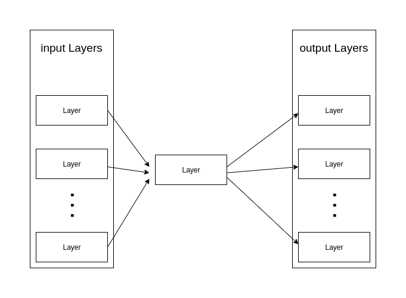
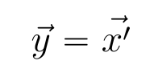
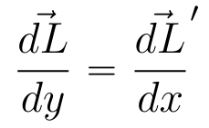
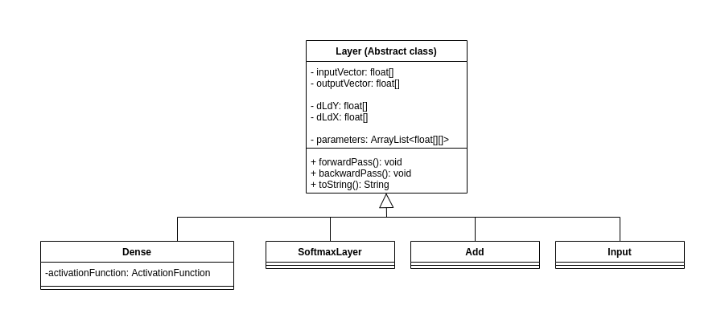
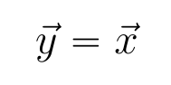
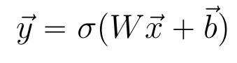
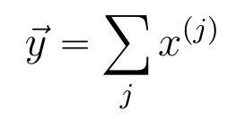
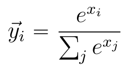

# Layer abstract class

The Layer abstract class provides the template for all layers that are used in a neural network.

## Features

Layers serve as the building blocks of neural networks. Each layer has the ability to perform a forward pass, which takes an input vector, 
performs some computation on it, and produces an output vector. When fitting a neural network, layers perform a backward pass, which calculates 
the gradient of the loss function with respect to layer parameters for a particular input vector. These two processes rely on connections with 
other layers. In fact, each Layer contains 2 lists that keep pointers to that Layer's input and output Layers:

This diagram also demonstrates the flow of data through a layer: The outputs of input layers become the input vector for the current layer, and the 
output of the current layer becomes the output layers' input vector. Mathematically, this can be expressed as:

where y is the layer's output vector and x' is the input vector of an output layer to the current layer. With this fact, we can also define 
how the loss vectors are calculated during the backward pass:

These two equations help illustrate the flow of data through the neural network during both prediction and fitting. During prediction, the input vector 
can only be used when the input layer's output vector is calculated (data flow forward). During fitting, a layer's vector loss with respect to the output vector is only known when the output layer's loss with respect to the input vector is known (data flows backward).

When a layer implements the forward and backward pass processes, the layer can be seamlessly added to a neural network that is ready to fit and make predictions 
without further modification.

## Methods

There are two primary methods that need to be implemented for a Layer class to be functional and can be used with both the fit() and predict() functions of the NeuralNetwork class.

### forwardPass()

The forwardPass() method performs all of the steps used to take in an input vector and produce an output vector. In all layers except for Input layers, the input vector will be populated by using the output vector(s) of previous layers. Once the layer's computations are complete, the result is placed into the output vector of the layer. The process repeats for each layer in the neural network.

### backwardPass()

The backwardPass() method performs all of the steps needed to compute the parameter loss gradient for this layer, as well as set up the vector derivatives for preceding layers. This method performs much more mathematically advanced computations, since multivariate calculus must be properly applied to obtain the proper gradients. This backward pass needs to accompolish two things: Find the gradient of the loss function with respect to the layer parameters, and find the gradient of the loss function with respect to the input vector.

## Derived classes

### Input

The Input layer serves as the starting point of a neural network. Here, the layer accepts the user provided input vector and simply outputs the same vector to the output/next layers. Due to the simple nature of this layer, there are no layer parameters or gradients. The forwardPass() method simply copies the input vector to the output vector. The backwardPass() method simply returns without actions, since there are no gradients to calculate at this layer.

Expressed with linear algebra, the Input layer is quite simple:

### Dense

The Dense layer serves as the standard, yet versatile computational layer. The forwardPass() method multiplies the input vector by a weight matrix, adds a bias term, and then applies a user chosen activation function (typically nonlinear) to produce the output vector. Although the linear algebra operations are quite simple, once these Dense layers are "stacked" together, more complex functions can be approximated. The backwardPass() method calculates the gradient of the loss function with respect to all the parameters (both the weight matrix and the bias vector), and then calculates the gradient of the loss function with respect to the input vector from the previous forwardPass() method call.

Expressed with linear algebra, the Dense layer is:

where the sigma function is the activation function.

### Add

The Add layer is a simple multi-input layer that is used to condense multiple input vectors into a single output vector. This is useful in complex Neural Networks such as Resnets, where "skip connections" let data flow past subsequent layers. The forwardPass() method simply performs vector addition on all input vectors to produce the output vector. This simple forward pass requires no parameters. The backwardPass() method is simple since it does not need to calculate the loss with respect to parameters only the loss with respect to the input vector.

Expressed with linear algebra, the Add layer is:

where x^(j) is the jth input vector (also the jth input layer's output vector)

### SoftmaxLayer

The softmax layer is used to convert any input vector into a discrete probability distribution. This layer is a useful output layer for classification tasks. The forwardPass() method takes the input vector an computes the exponential of each element. These elements are then divided by the sum of the elements to form a probability distribution where each element is in the range (0,1) and all element sum to 1. The backwardPass() method only needs to compute the loss with respect to the input vector since there are no parameters. Note: The reason Softmax is a layer instead of an activation function is that activation functions in this library are elementwise, and the softmax function needs an entire vector to produce the output vector.

Expressed with linear algebra, the Softmax Layer is:

where i is the specific component index of the output vector and j is the component index which goes to all components.