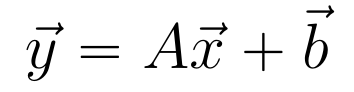

# LinearModel

The LinearModel class is the simplest derived class of the SimpleModel abstract class.

## Features

The LinearModel can learn simple linear relationships between training inputs and outputs.

Mathematically, a LinearModel instance can be described using linear algebra:

where all entries in the weight matrix A, and bias vector b are learnable parameters.

Additionally, each component of the output vector can be described as:

where theta_i,j and b_i are learnable parameters. 

## Implementation

The LinearModel is implemented using the linear algebra form. The weight matrix and the bias vector are stored as 2 dimensional floating point arrays in the parameter list.

When making predictions, the output vector is populated by doing matrix-vector multiplication on the weight matrix and input vector. Then, this resulting vector is added to the bias vector to create the output vector.

## Examples

There are two examples in the Examples.java class which demonstrate and test the features of this class: "simplelinear" and "complexlinear"

## Considerations

Although the LinearModel is very simple, it is quite limited in functionality. Any non-linear data that is used as input will not produce desirable results. Additionally, there is no way for the user to control the number of parameters in the model: with n inputs and m outputs, there are exactly nm + m learnable parameters.
