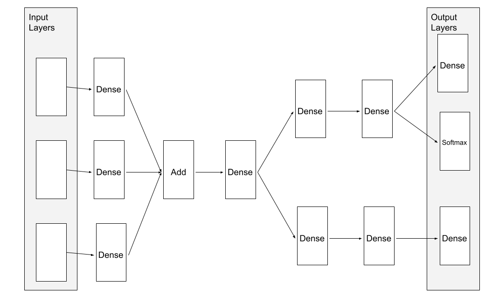

# NeuralNetwork

The NeuralNetwork class is a derived class of the [Model](Model.md) abstract class. Neural networks consist of multiple layers which perform computations
on data. These layers can be constructed to form deep neural networks which can learn complex relationships between input and output training data. 

## Features

In addition to model complexity, there are two primary features of the NeuralNetwork class.

First, NeuralNetworks have the ability to be constructed to accept multiple input vector and produce multiple output vectors. This differs from
the [SimpleModel](SimpleModel.md) abstract class and it's derived classes, which can only accept one input vector and produce one output vector.

Second, the NeuralNetwork class implements Neural Networks as a computational graph. This means that the neural network can be modeled as a directed
acyclic graph. A directed edge from layer u to layer v means that the output of layer u becomes part of layer v's input vector.

An example of these two features are shown with a neural network constructed in the nncomplex [example](Examples.md):

As seen in the diagram, this neural network has 3 input layers for 3 input vectors and 3 output layers for 3 output vectors. The computational graph
structure also allows layer output vectors to be distributed to multiple other layers, or take in multiple input vectors and produce a single
output vector (in the case of the Add layer).

These features grant the user a high degree of freedom when constructing neural networks for their specific needs.

## Implementation

The NeuralNetwork class contains several primary fields that represent the computational graph structure of the neural networks. These fields are
ArrayLists of Layers containing pointers to the Input layers, output layers, and all layers in the neural network. The connections between the layers
are stored as ArrayList fields in the layers themselves (see [Layer documentation](Layer.md)).

The computational graph structure makes use of modified graph traversal algorithms in order to make predictions (commonly refered to as the "forward pass")
and calculate the gradient of the loss function with respect to parameters (commonly refered to as the "backward pass")

### Forward Pass

The prediction (or forward pass) process involves calling the forwardPass() method on each layer in the neural network. However, the order in which
these layers call forwardPass() matters. In a typical neural network where layers are connected in a linear fashion, the forwardPass() method would be 
called on the one Input layer, then the next layer, and so on until forwardPass() is called on the output layer, producing the output vector.

For a neural network which is structured like a directed acyclic graph, the process is not as simple. However, there is a fairly simple rule
that can determine if a layer is ready for forwardPass() to be called:

If forwardPass() has been called on all layers u where a directed edge exists between u and v, then forwardPass() can be called on v.

To keep track of which layers need to have forwardPass() called in order, a stack data structure is used. Layers are placed on the stack
in such a way where layers at the top of the stack need to have forwardPass() called before the layers below them on the stack. A set data
 structure is used to tell if a layer has already had forwardPass() called on it.

The forward pass process is complete when the layers at the bottom of the stack (the output layers) have had forwardPass() called on them.

The result of this process is that computations within the neural network flow from the input layers to the output layers, producing the
 output vectors.

### Backward Pass

The backward pass process is used to find the gradient of the loss function with respect to neural network parameters for a specific training input and output
pair. This process is extremely similar to the prediction/forward pass process described above. In order for a layer to have backwardPass() called (and determine the loss vectors for this layer), any output layers need to have called backwardPass() first. This rule is the forward pass rule in reverse:

If backwardPass() has been called on all layers v where a directed edge exists between u and v, then backwardPass() can be called on u.

Like the forward pass process, a stack and set are used to keep track of what order layers need backwardPass() called and if they have already had backwardPass() called.

The backward pass process is complete when the layers at the bottom of the stack (the input layers) have had backwardPass() called on them.

The result of this process is that the loss computations work backwards from the output layers to the input layers. Also, each layer has their gradient
field populated so that the gradients can be applied to the parameters in order to reduce the loss.

## Examples

There are several [examples](Examples.md) that demonstrate how to create, fit, evaluate, predict, and save neural networks to disk.

These examples are: nnquadratic, nnoverfit, nnbinaryclassification, nnresnet, nnmulticlass, nncomplex

## Considerations

Although using neural networks are a mainstream machine learning technique, there are some considerations to be aware of when using them in a project.

First, most neural networks have many more parameters than their simple counterparts, such as the LinearModel and the PolynomialModel. Although this may
be a good thing for users looking to model more complex relationships, the large number of parameters occupy a larger space in memory, take up more space
when saved to disk, and are more prone to overfitting. Techniques such as k-folds cross validation may alleviate overfitting concerns.

Second, depending on the structure and sizes of the layers that make up a neural network, prediction, evaluation, and fitting time may be slow. This is
because many of the operations involved in producing an output vector for a layer involve matrix vector multiplication, which takes a long time to complete.
These operations done across many layers compounds the runtime of a single prediction, evaluation, or gradient calculation.