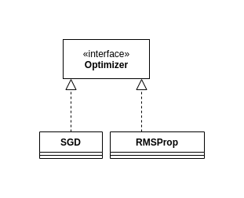

# Optimizer

The Optimizer interface defines the functionality that any implementing class must complete in order to process loss function gradients
when fitting parameterized functions. This is a very simple interface that only needs one function to be implemented.

## The Optimizer interface

### ArrayList<float[][]> processGradient(ArrayList<float[][]> rawGradient)

As the sole method to implement in this interface, the processGradient method takes a "raw" gradient of the loss function (calculated through the
private calculateGradient() method), performs some sort of processing or calculation, and then returns a new gradient that will then be scaled
and directly applied to model parameters.

The specific process or calculation that is used to create the new gradient is up to the implementation. Generally, many of these implementations
seek to promote training stability through controlling the average absolute value of the components (see RMSProp).

The primary restriction when implementing this interface is that the returned value must be of the same shape as the input, meaning the ArrayLists must
be the same size as well as each 2d float matrix having equal dimensions between the same index in both ArrayLists.

## Implemented classes

### SGD

The most basic implementation of the Optimizer interface. The SGD (Stochastic gradient descent) optimizer does not perform any complicated processing, calculation or
modification of the input rawGradient, and simply returns the rawGradient after scaling it with a user defined learning rate that is greater than 0.

This optimizer is the most intuitive to understand, does not require any additional space, and due to the lack of extensive processing, is quite fast.

However, this optimizer does not provide any means of avoiding the "dying gradient problem", where the absolute values of components become very small
and learning slows down. This is because the only processing done is multiplying each component by a constant scalar, which does not alleviate the problem.

### RMSProp

The RMSProp implementation of the Optimizer interface utilizes and maintains a internal optimizer state to make modifications to the input raw gradient.

The internal optimizer state maintains a exponentially moving average of each gradient component squared. When processGradient() is called, this internal
state is updated using the following rule on each component in the gradient:

avgSqC = (rho * avgSqC) + (1-rho)(c^2)

where c is the raw gradient component, avgSqC is the exponentially moving average of c^2 over many calls to processGradient(), and rho is a user
defined hyperparamter that controls how much weight the old estimate of the exponentially moving average, avgSqC has during an update.

Then, the processed gradient is created and populated as:

g = lr * (1/sqrt(avgSqC)) * c

where g is the processed gradient component and lr is the user defined learning rate greater than 0. The general idea of this update is to use
the scalar (1/sqrt(avgSqC)) as a way of "dampening" the raw gradient component of c. In a way, this scaling aims to keep (1/sqrt(avgSqC)) * c 
roughly equal to 1. Scaling again by the user's learning rate aims to keep the average updates to the model's parameters roughly equal to that
 learning rate.

 