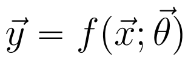

# SimpleModel

The SimpleModel abstract class defines the template for parameterized functions that have exactly one input and one output vector.

## Features

The SimpleModel abstract class was designed to provide features common to single input/output vector parameterized functions. Mathematically, SimpleModels can be expressed as:

The abstract class provides the fields and methods to access and modify the parameters as well as performing training and prediction on data.

In order to create a derived class, a user must implement the abstract methods in addition to a constructor. Namely, the fit() and predict() methods.

## Derived classes

There are currently two derived classes of SimpleModel: [LinearModel](LinearModel.md) and [PolynomialModel](PolynomialModel.md).

