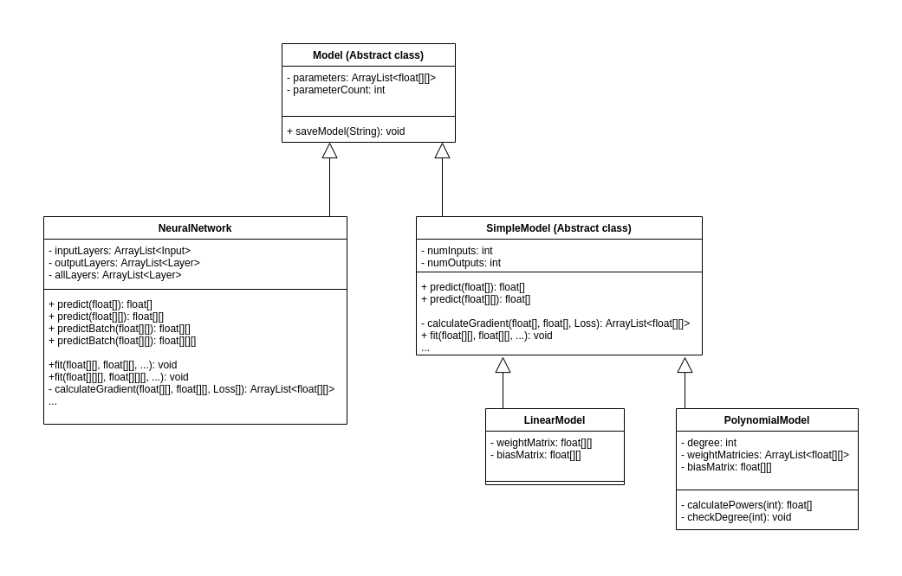

# JPF: Java Parameterized Functions

## Overview

## Motivation

I was motivated to create this project for several reasons.

First, I was intrigued by the mathematics behind supervised machine learning and figured that the best way to learn them would be to understand the 
multivariate calculus behind it and then implement the math myself.

Second, I wanted to focus on my Java programming skills and decided that this project would provide an excellent opportunity to use Java's object oriented
design features to build a software package that would contain components that were easily testable, extendable, as well as easy to understand. Since I've had
 enjoyable experiences with the Tensorflow and Keras machine learning libraries using Python, I wanted to achieve similar results with Java.

## Design

The JPF library is designed using Java's OOP and abstraction mechanisms. Use of abstract classes and interfaces allows for fast development of classes
through code reuse and inheritance of data and behavior. These relationships are demonstrated through the Model UML summary diagram:

This UML diagram is only a small section of the [complete UML summary diagram](docs/images/uml_all.png). More sections of this design are discussed
in the various pages of documentation.

This design also makes it easier for users to extend classes to create their own components that seamlessly integrate with this library. For example, following the
documentation for extending classes, a user can create their own layers, loss functions, optimizers, and activation functions.

## Important Documentation

The following classes and interfaces make up the core of this package's functionality.

- [Model](docs/Model.md) (abstract class)
    - [SimpleModel](docs/SimpleModel.md) (abstract class)
        - [LinearModel](docs/LinearModel.md)
        - [PolynomialModel](docs/PolynomialModel.md)
    - [NeuralNetwork](docs/NeuralNetwork.md)
        - [Layer](docs/Layer.md) (abstract class)
            - [ActivationFunction](docs/ActivationFunctions.md) (abstract class)
- [Loss](docs/Loss.md) (interface)
- [Optimizer](docs/Optimizer.md) (interface)
- [Miscellaneous classes](docs/misc.md)
- [Extending classes](docs/ExtendingClasses.md)

## Tests

This project demonstrates software testing via black box and unit tests.

The black box tests are used to test correctness of the LinearModel, PolynomialModel, and NeuralNetwork classes.
These black box tests work by conducting several scenarios involving parameterized functions and seeing if their
behavior matches what is expected. For example, when fitting a Neural Network to some training data, it is expected
that the training loss will decrease. These black box tests are implemented as [examples](docs/Examples.md) that have clear goals for
expected outcomes. Check the "Running examples" subsection in the "How to run" section to learn how to run these examples.

Unit testing is done on both the Utility and LinearAlgebra classes. These classes are well suited for unit testing
since they contain very small static helper functions with predictable outputs. The unit test cases are located in
Tests.java file. Check the "Running tests" subsection in the "How to run" section to learn how to run these tests.

## How to run